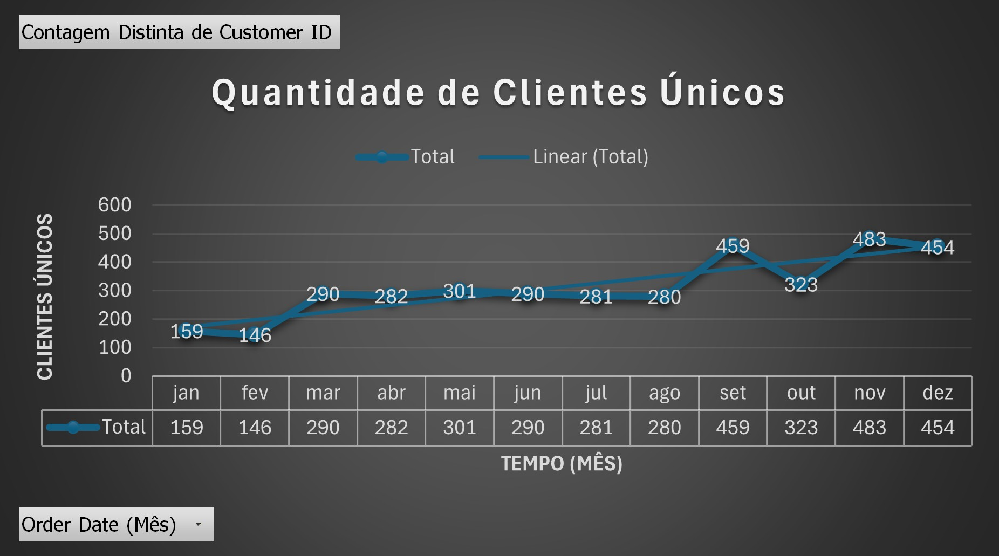
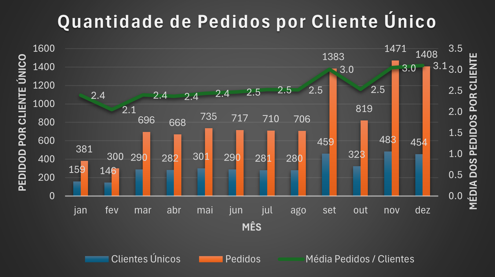
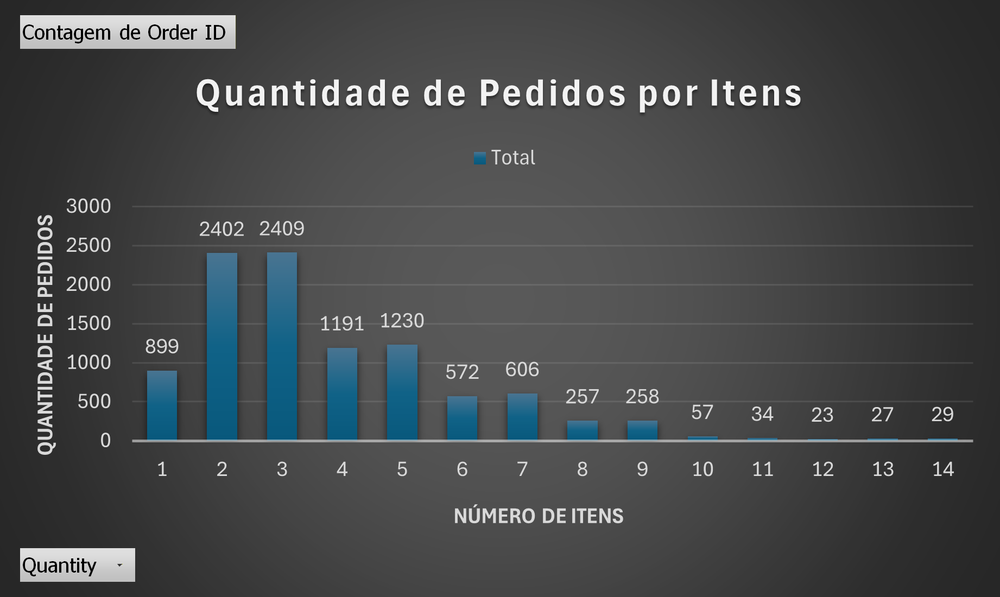
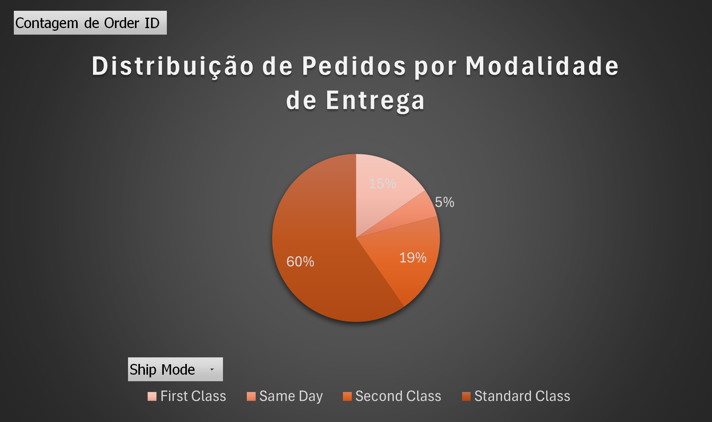
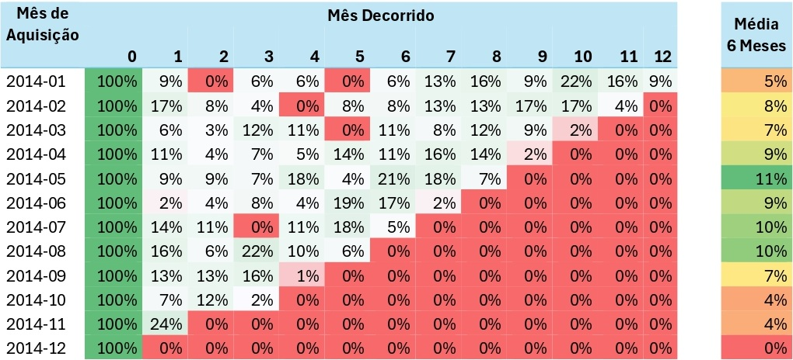
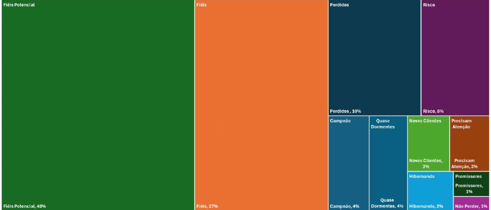

# Rede de Supermercados SuperStore

Projeto de análise os pedidos de compra e insights para o área de negócio da rede de supermercado Super Store.

# 1. Contexto 

A SuperStore é uma rede de supermercados com várias unidades físicas espalhadas por todo país, com o objetivo de fornecer alimentos e comercializar os mais diversos produtos para consumo. 

O time de gerentes da SuperStore decidiu construir um time de dados para facilitar as decisões da empresa com relação ao abastecimento de produtos das lojas e também das vendas. Hoje, os gerentes têm acessos a algumas planilhas de dados com informações pontuais que ajudam nas decisões, mas eles gostariam que todos os dados da empresa fossem integrados de modo com que cada área acompanhasse os mesmos indicadores.

O time de dados vai desempenhar um papel importante na criação desses indicadores da empresa, pois terão acesso aos dados transacionais para analisar o comportamento dos clientes, descrevendo os produtos que mais  compram, a quantidade comprada, o tamanho da cesta de compra, o valor médio de gasto em cada compra, os produtos devolvidos, os números de pedidos feitos dentro de um determinado tempo e assim por diante. 

Essas análises de dados geram insights que abrem espaço para entender como o negócio da empresa funciona do ponto de vista analítico, as razões de aumento ou diminuição dos números de pedidos, entre outras perguntas cuja resposta ajuda na tomada de decisão.

O problema de negócio inicial é analisar os pedidos de compra e trazer insights para a área de negócio. 

# 2. Análises Iniciais - Pedidos 

O volume de pedido inicia com 381 em janeiro, tem queda em fevereiro para 000 e segue de março a agosto estável, e possivelmente ocorre alguma ação que faz aumentar o volume de pedidos em setembro e mesmo com queda em outubro os números estão superiores aos meses que apresentaram estabilidade e com alguma nova ação, os pedidos de novembro voltam a subir seguido de pequena queda em dezembro. Apesar de oscilações pontuais, o comportamento indica expansão da demanda e mais resultado do negócio, especialmente nos meses finais.

Considerando os resultados pela visão de cliente é possível notar que a quantidade de clientes neste mesmo período é muito semelhante em termos de comportamento, quando aumenta o número de clientes e são captados por um tempo, também aumenta o crescimento neste mesmo período de setembro e outubro. 

Para esclarecer a dúvida se foi a quantidade de clientes únicos que influenciou o aumento de pedidos ou foi o número de medidos feitos por cada cliente e fica evidente que o crescimento do negócio não depende apenas de novos clientes, mas do aumento da frequência de compra dos clientes existentes. Isso pode ser observado em setembro que tem um aumento de 3 pedidos por cliente. 

A maioria dos pedidos realizados contém de 2 a 3 produtos, depois de 4 a 5 produtos, pode-se considerar que são comprar rápidas de itens que estão faltando, não uma grande compra mensal, aqui pode-se incentivar o aumento da aquisição de itens faltantes no dia a dia. 

Sobre a modalidade de entrega, que é como as pessoas querem que seja feita a entrega, 60% é entrega padrão, não há pressa em receber, porém dois grupos de clientes optam pela entrega segunda classe 19%, primeira classe 15% e entrega no mesmo dia é de 5%. É possível aplicar alguma estratégia para distribuir o grupo de entrega padrão para ter entrega mais rápida e aumentar o ticket. 

# 3. Novo Problema de Negócio - Análise de Cohort

A partir das análises iniciais o time de gerentes da SuperStore identificou um desafio crescente: a retenção de clientes. A empresa percebeu que, embora as vendas continuem ocorrendo, a frequência de compras de clientes recorrentes tem diminuído.

O time de dados terá um papel fundamental na criação de indicadores que mostrem como os clientes interagem com a SuperStore ao longo do tempo. 
Essas análises vão gerar insights valiosos que permitirão à SuperStore entender os motivos que levam os clientes a diminuir suas compras ou a não retornar, além de oferecer soluções para melhorar a retenção. 

### Questões como: 
"O que está fazendo com que os clientes deixem de comprar na SuperStore?", "Quais iniciativas podem reverter esse comportamento?", e "Como podemos aumentar a fidelidade dos nossos clientes?" serão respondidas a partir dos dados. O desafio é medir a retenção de clientes. 

## Qual é a retenção de clientes ao longo dos meses? 

A retenção analisada considera um intervalo de compras de 6 meses a partir do retorno do cliente no mês seguinte: 

•	Cohort de Janeiro: no mês de fevereiro 9% dos clientes reiteraram suas compras, seguindo com queda de 0% e valores pontuais de 6% sem recorrência consistente ao longo dos meses; 

•	Cohort de Fevereiro: no mês de março apresenta aumento relevante, 17% dos clientes voltaram a comprar, porém nos meses seguintes isso não se mantém; 

•	Cohort de Março: o mês de abril apresenta retenção de 6%, é uma queda importante em relação ao mês anterior; 

•	Cohort de Abril: em maio 11% dos clientes voltaram a comprar, é um valor positivo que é superior a janeiro e março;

•	Cohort de Maio: em junho houve 9% de retenção por 2 meses, seguindo de queda de 7% no terceiro mês e aumento de 18% no quarto mês; 

•	Cohort de Junho: o mês de julho mostra que houve queda de 2%, os valores seguintes se mantiveram baixos até o quinto mês com aumento de 19%. 

De modo geral é possível identificar que poucos cohorts mantiveram picos de retenção ao longo dos 6 meses, sendo que fevereiro apresentou o melhor resultado de 17%. 

## Quais cohorts apresentam maior e menor retenção? 

Considerando a média dos 6 meses após a primeira compra, é possível identificar que os cohorts que tiveram a maior retenção foram os de maio com 11%, agosto com 12% e setembro com 10%. 
E quanto aos cohorts de menor retenção também com média dos 6 meses após a primeira compra, os meses de janeiro com 5% e março e dezembro com 7%. 

## Existem fatores sazonais que impactam a retenção?

Pode haver fatores que impactam a sazonalidade como investimento em marketing, lançamento de produtos novos ou redução de preço, oferta de alguma promoção, porém não é possível afirmar que são ações que impactaram na retenção, esses podem ser alguns dos indicadores que mostram que os clientes compraram novamente.

# Novo Problema de Negócio - Análise de RFM

Com o desenvolvimento da análise de Cohort, pelo time de dados para acompanhar a retenção dos clientes da rede e revelando números bons para alguns Cohorts e ruim para outros.

Como essa informação, os gerentes resolveram fazer ações distintas para grupos específicos de clientes, a fim de aumentar a taxa de retenção da empresa. Porém, eles não sabem como segmentar a base de clientes em grupos e nem qual seria a necessidade para planejar a ação. 

Esse desafio chegou até o time de dados que precisava segmentar a base de clientes, criando grupos menores com necessidades específicas para uma ação mais precisa do time de Marketing e Produtos.

O seu próximo problema de negócio é criar uma segmentação de clientes e explicar as áreas de negócio, como Marketing, Vendas e Produto, à necessidade de cada grupo e quais ações poderiam ser feitas para aumentar a retenção.

## Quem são os “Campeõesˮ e “Clientes em Riscoˮ? 

•	Campeões são caracterizados como clientes que compraram com alta frequência, gastam valores elevados (alta monetização) e fizeram compras recentemente (baixa recência), são segmentos de referência que representam o melhor comportamento possível dentro da base e servem como parâmetro para comparar com os demais. 

•	Clientes em Risco aparecem quando a recência começa a aumentar (muito tempo sem comprar), mesmo tendo boa frequência ou monetização, são clientes que já compraram, podem ter sido bons clientes e estão em risco principalmente pelo tempo sem compra, podem evoluir para perdidos se nenhuma ação for tomada. 

## Como os clientes estão distribuídos entre os segmentos RFM? 

Os clientes estão distribuídos em 11 segmentos representados na matriz de distribuição, sendo que o gráfico mostra a quantidade de clientes em cada segmento. Essa distribuição representa um diagnóstico da base atual e ao longo do tempo as proporções podem sofrer alterações de acordo com as ações do negócio, ou seja, segmentos menores podem crescer e os maiores podem diminuir de acordo com a eficácia das ações de retenção. 

Clientes Campeão (4%) é importante manter a recência e frequência e há possibilidade de aumentar a monetização se comparado aos clientes Não Perder (1%). 
Para Novos Clientes (2%) e Promissores (1%), pode aumentar a quantidade de pedidos, devido a frequência está baixa e a monetização porque os gastos apresentam valores baixos, comparados a Campeão (4%)  e Fiéis (27%), há margem para crescimento. 

Quanto aos clientes Fiéis (27%) e Fiéis Potencial (40%) uma estratégia é diminuir a recência, aumentar a frequência e a monetização.

Clientes como Não Perder (1%) é importante focar em diminuir a recência pois apresentam um alto valor de compra tem ótima frequência.

Os grupos de clientes Precisam de Atenção (2%) e Risco (8%) requerem redução da recência como medida urgente e apresentam potencial para aumentar a frequência e a monetização. 

Sobre os segmentos mais distantes ou com menor monetização como Quase Dormente (4%), Promissores (1%), Hibernando (2%) e Perdidos (10%) pode ser realizada reativação ou avaliação de custo-benefício. 

## Quais ações podem ser tomadas para fidelizar clientes ou recuperar os em risco? 

Considerando o segmento Campeão, que pode ser considerado referência por possuir melhor recência (fizeram compras recentemente), alta monetização (apresentam gastos elevados) e boa frequência (tem grande quantidade de compras), algumas ações são relevantes para os demais clientes mudarem os status atual. 

A estratégia que exige menor esforço e maior impacto para o negócio pode ser iniciada a partir do segmento Não Perder pois apresenta a maior monetização do grupo e precisa apenas de uma nova compra. 

O próximo segmento é Fiéis que possui boa frequência e monetização, Fiéis Potencial que embora a frequência não seja alta, apresenta potencial para aumentar a monetização, uma alternativa é a oferta de produtos com ticket alto. 

Para o segmento Novos Clientes e Promissores que dispõe de baixa frequência e monetização, a opção pode ser oferta de produtos com ticket baixo. 

Os segmentos Quase Dormentes, Precisam Atenção, Hibernando, Risco e Perdidos demandam como ação primária uma nova compra por apresentarem alta recência (fizeram suas compras há mais de 180 dias). 

# 4. Novo Problema de Negócio - Desempenho de Produtos e Localizações

## Quais produtos geram maior receita e quais possuem baixo desempenho? 

O gráfico apresenta o faturamento total mensal ao longo do ano (jan a dez), com uma linha de tendência indicando pontos de crescimento neste período, no primeiro semestre há oscilação de valores iniciando com $94 mil em janeiro, seguido de queda para $59 mil em fevereiro sendo este o menor mês, março apresenta aumento significativo de $305 mil e em abril ocorre uma queda das vendas ficando estável até agosto, em setembro o valor de vendas aumenta para $307 mil, com nova queda relevante em outubro, o mês de novembro tem o maior valor do ano $362 mil e dezembro fecha com pequena queda com $325 mil. 

O gráfico mostra os produtos que geraram maior receita com os 10 itens de maior impacto financeiro para o negócio, o produto líder é Canon imageCLASS 2200 Advanced Copier com faturamento de $253 mil, a partir do segundo produto é possível notar uma queda gradual sendo o 3D Systems Cube Printer, 2nd Generation, Magenta com o menor valor de $84 mil. 

O gráfico mostra os produtos que geraram menor receita com os 10 itens de menor resultado, são valores muito baixos quando comparados aos produtos de maior receita, são produtos que variam entre $3 como o Eureka Disposable Bags for Sanitaire Vibra Groomer I Upright Vac e $19 tal como PNY Rapid USB Car Charger - Black. 

## Existe uma relação entre o desempenho das lojas e as regiões em que estão localizadas?

Ao analisar a venda por região, observa-se que a região Oeste apresenta um desempenho superior com $725 mil de vendas, seguida da região Leste com $679, há uma diferença significativa entre demais regiões, pois as duas primeiras representam a maior parte do faturamento. A Central que mostra $501 mil e por último a região Sul com $392 mil o menor valor de venda.

## Principais Descobertas 

A retenção de clientes é baixa e instável ao longo do tempo e o principal desafio do negócio não é aquisição, mas recorrência e retenção. Alguns meses apresentam retenção média melhor, sugerindo influência de sazonalidade e há indícios de sazonalidade positiva, mas sem evidência causal clara. 

A base de clientes é constituída de diferentes segmentos e existe grande potencial de conversão de clientes médios em clientes de alto valor. Alguns pequenos ajustes podem gerar grande impacto financeiro como no segmento Não Perder (1%), uma única recompra pode evitar perda de clientes altamente valiosos, ações simples de reativação podem gerar retorno rápido e com baixo custo. As estratégias devem ser diferentes para cada segmento, considerando o perfil de consumo de cada grupo. 

O faturamento cresce ao longo do ano, mas com alta volatilidade, o negócio cresce, mas é dependente de picos específicos, o que aumenta risco. 

A receita é altamente concentrada em poucos produtos e há dependência excessiva de produtos-chave, o que pode representar risco. 

Diferenças regionais impactam fortemente os resultados, a localização pode ser um fator que influencia diretamente o desempenho das lojas. 

A SuperStore possui dados ricos e bom desempenho em produtos, regiões e segmentos específicos, porém enfrenta baixa retenção, alta concentração de receita e forte desigualdade regional. 

O maior potencial de crescimento está em reter melhor os clientes atuais, especialmente aqueles já engajados, antes de focar apenas em aquisição.

